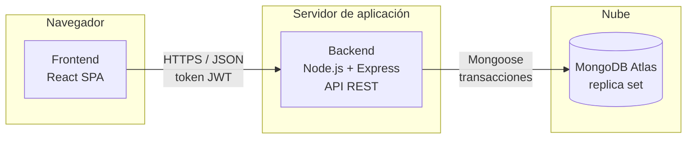
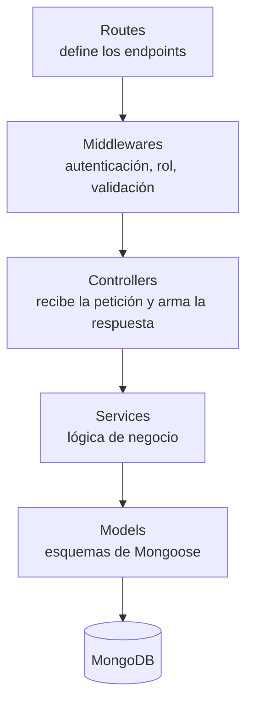

# Arquitectura del Proyecto

**Proyecto:** Sistema Centralizado de Punto de Venta (POS) e Inventario
**Entrega:** 2.ª Entrega — Diseño y Módulos
**Integrantes:** Ignacio Salazar, Martin Gomez, Walter Verdun

---

## 1. Visión general

El sistema es una **aplicación web cliente-servidor** compuesta por tres piezas independientes que se comunican por red:

1. **Frontend:** aplicación de página única (SPA) en React, que se ejecuta en el navegador del cajero o del administrador.
2. **Backend:** API REST en Node.js con Express, que concentra toda la lógica de negocio y las reglas de seguridad.
3. **Base de datos:** MongoDB, alojada en un servicio en la nube.

El frontend nunca accede a la base de datos: toda operación pasa por la API, que valida los datos y los permisos del usuario antes de ejecutarla.

---

## 2. Patrón arquitectónico del backend: capas sobre MVC

El backend sigue una **arquitectura en capas basada en MVC**. La vista del MVC clásico la reemplaza el frontend React: la API solo devuelve JSON.

| Capa | Responsabilidad | Ejemplo |
|---|---|---|
| **Routes** | Asocia cada URL y método HTTP a un controlador. | `PUT /api/precios/lote` → `preciosController.aplicarLote` |
| **Middlewares** | Controles previos comunes a muchas rutas. | Verificar el token JWT y que el rol sea `admin`. |
| **Controllers** | Traducen HTTP a llamadas de negocio. No contienen reglas de negocio. | Leer el porcentaje del cuerpo de la petición y responder `200` con la cantidad de productos afectados. |
| **Services** | Reglas de negocio y operaciones sobre varias colecciones. | Aplicar el aumento, registrar el lote en `ajustes_precio` y el detalle en `historial_precios`. |
| **Models** | Estructura, tipos y validaciones de cada colección. | `Producto` con `stock: { min: 0 }`. |

**Justificación:**

- **Separación de responsabilidades.** La lógica más crítica del sistema (confirmar una venta, aplicar un aumento masivo, revertir un lote) queda aislada en los servicios, sin depender de Express. Se puede probar sin levantar un servidor.
- **Trabajo en paralelo.** Con capas bien delimitadas, los tres integrantes pueden desarrollar módulos distintos sin pisarse.
- **Escala adecuada al proyecto.** Se descartaron los **microservicios**: para un equipo de tres personas y un único comercio, agregarían complejidad de despliegue y comunicación sin ningún beneficio real. Un monolito en capas bien organizado puede dividirse más adelante si el sistema crece (por ejemplo, a multi-sucursal).

La estructura de carpetas que implementa este patrón está descrita en [`/backend/README.md`](../backend/README.md).

---

## 3. Organización del frontend

El frontend es una **SPA** organizada por responsabilidades: las páginas se arman con componentes reutilizables, el estado compartido vive en contextos de React y toda la comunicación con la API se concentra en la capa de servicios.

**Justificación de la SPA:** en la caja, cada segundo cuenta. Una SPA carga la aplicación una sola vez y después solo intercambia datos con la API, sin recargar la página en cada producto escaneado.

La estructura de carpetas está descrita en [`/frontend/README.md`](../frontend/README.md).

---

## 4. Tecnologías definitivas

| Capa | Tecnología | Uso |
|---|---|---|
| Frontend | **React 19** + **Vite** | Construcción de la interfaz y entorno de desarrollo. |
| Frontend | **React Router** | Navegación entre pantallas (POS, catálogo, precios, reportes). |
| Frontend | **Axios** | Cliente HTTP de la capa de servicios. |
| Backend | **Node.js 24 LTS** | Entorno de ejecución del servidor. |
| Backend | **Express 5** | Framework de la API REST. |
| Backend | **Mongoose** | Modelado de datos, validaciones y transacciones sobre MongoDB. |
| Seguridad | **JSON Web Token (JWT)** | Autenticación sin estado entre el frontend y la API. |
| Seguridad | **bcrypt** | Cifrado de contraseñas. |
| Base de datos | **MongoDB Atlas** | Base de datos documental administrada en la nube. |
| Control de versiones | **Git** + **GitHub** | Repositorio único, ramas por funcionalidad y Pull Requests. |
| Despliegue | **Render** (backend) y **Vercel** (frontend) | Publicación del servicio en la nube (4.ª entrega). |

---

## 5. Justificación de las decisiones técnicas

### 5.1 Stack MERN

Un único lenguaje, JavaScript, en todas las capas, y **JSON de extremo a extremo**: el mismo formato de datos en la base, en la API y en la interfaz, sin traducciones intermedias. Además es el stack que domina el equipo, lo que reduce el riesgo dentro de los plazos de la materia.

### 5.2 MongoDB como base documental

La decisión está analizada en detalle en la sección 2 de [`esquema-bd.md`](./esquema-bd.md). En resumen, el modelo documental favorece las dos operaciones más frecuentes del sistema: la venta en caja (el ticket es un documento autocontenido) y la actualización masiva de precios (`updateMany` ejecutado en el servidor de la base).

### 5.3 MongoDB Atlas (replica set)

La confirmación de una venta descuenta stock y registra el ticket en una **transacción**, de modo que se confirman las dos cosas o ninguna. En MongoDB, las transacciones **solo están disponibles en un replica set**, no en un servidor aislado. Atlas provee un replica set incluso en su plan gratuito, por lo que cumple este requisito sin configuración adicional y resuelve además el despliegue en la nube que exige la 4.ª entrega.

### 5.4 Node.js y Express

Node.js maneja muchas peticiones concurrentes con E/S no bloqueante: varias cajas pueden operar a la vez sin que una bloquee a otra. Express es minimalista y es el framework de referencia del ecosistema, lo que facilita la organización en capas con middlewares.

### 5.5 React

La pantalla de caja cambia constantemente: productos que se agregan, cantidades, totales y vuelto. El modelo de componentes y el renderizado reactivo de React actualizan solo lo necesario, y los componentes (buscador, carrito, tabla de productos) se reutilizan entre pantallas.

### 5.6 Autenticación con JWT

La API no guarda sesiones: cada petición lleva un token firmado que identifica al usuario y su rol. Esto simplifica el despliegue del backend y permite que un middleware verifique los permisos antes de llegar al controlador (por ejemplo, solo un `admin` puede aplicar un aumento masivo).

---

## 6. Seguridad

- Contraseñas cifradas con bcrypt; nunca se almacenan ni se devuelven en texto plano.
- Autorización por rol aplicada en el backend. Ocultar botones en el frontend no se considera una medida de seguridad.
- Validación de todos los datos de entrada en la API, antes de llegar a la base.
- Credenciales (cadena de conexión a la base, clave de firma de JWT) en variables de entorno, fuera del repositorio.
- Comunicación por HTTPS en el entorno desplegado.

---

## 7. Flujo de trabajo del equipo

- Rama `main` como versión estable del proyecto: no se trabaja directamente sobre ella.
- Una rama por funcionalidad o corrección, integrada a `main` mediante Pull Request.
- Commits pequeños y descriptivos, uno por cambio lógico.
- Todo cambio en el diseño de la base de datos se registra en el registro de cambios de [`esquema-bd.md`](./esquema-bd.md).
