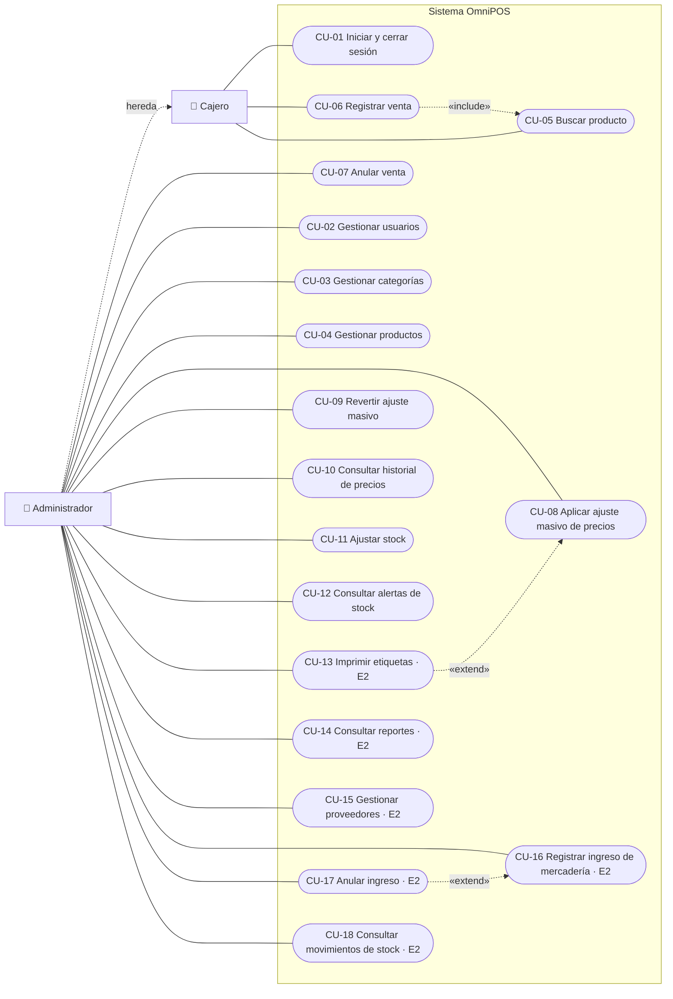
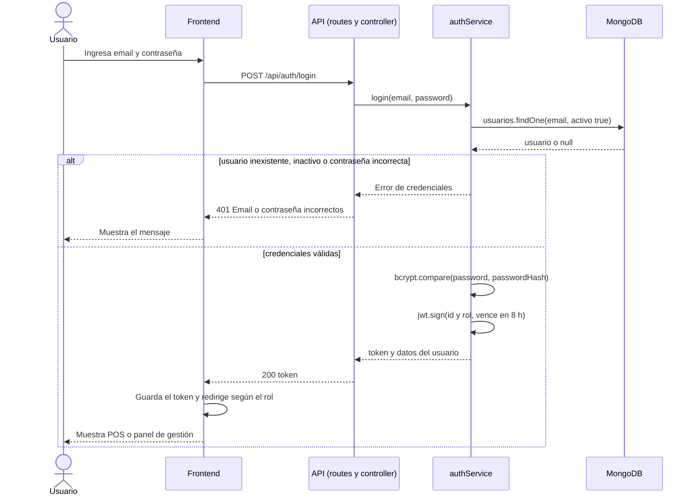
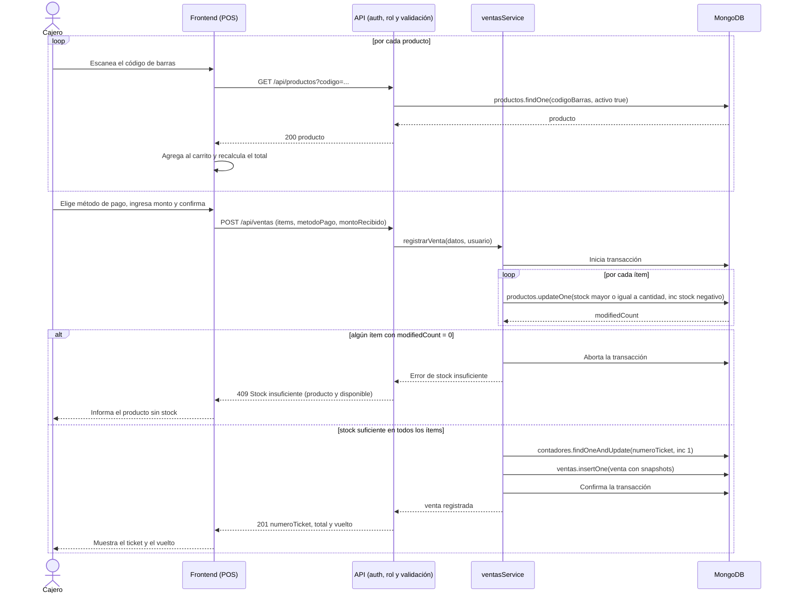
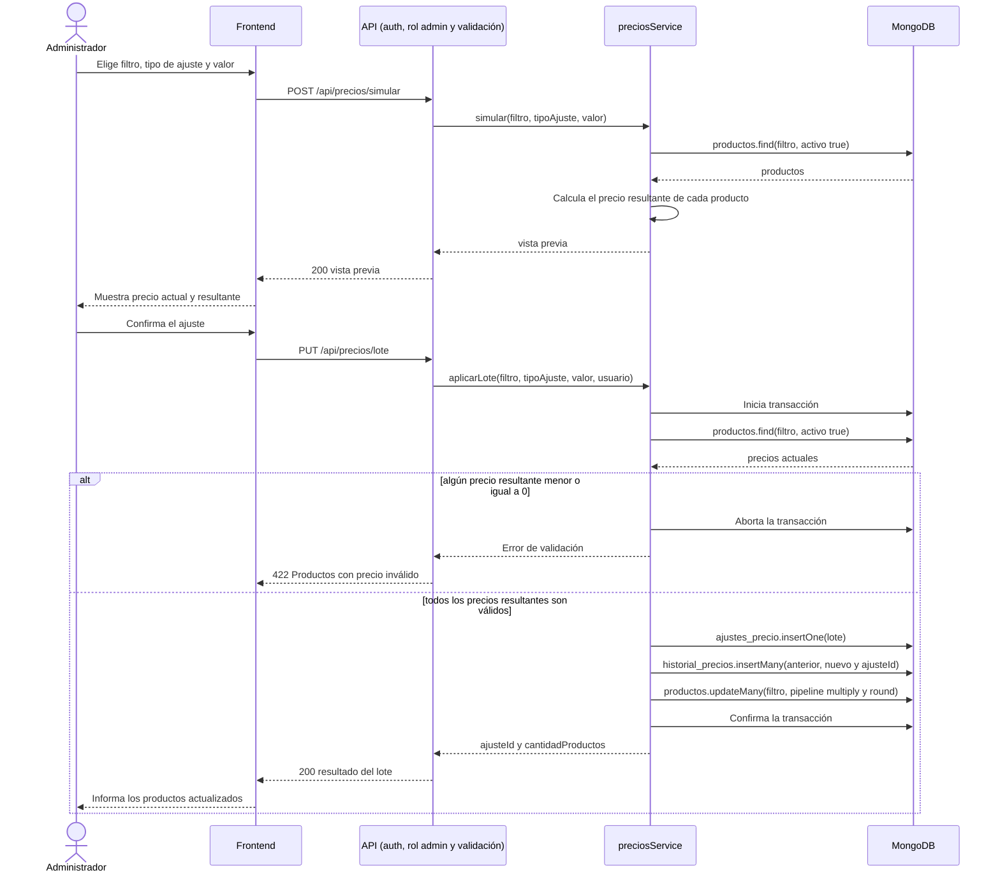
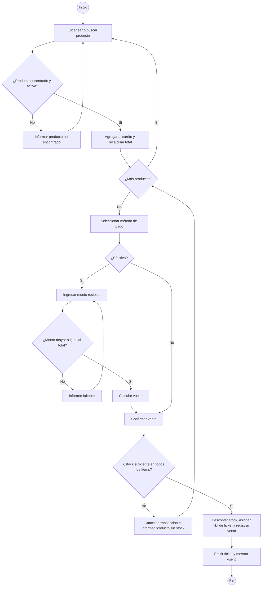
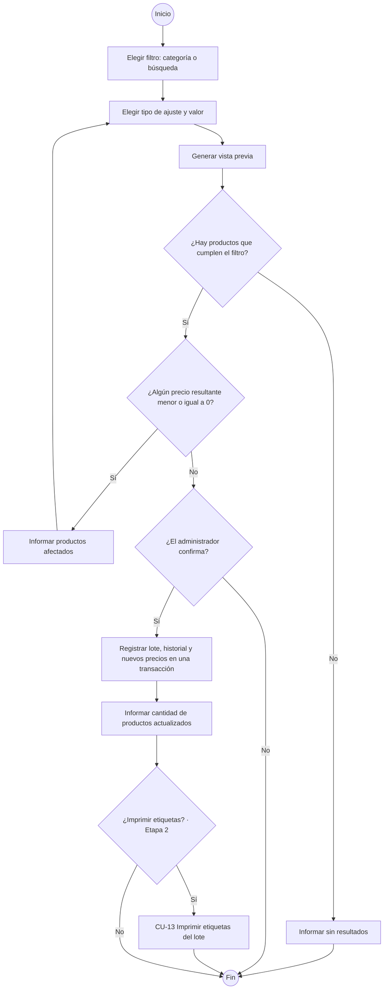

# Casos de Uso y Diagramas de Comportamiento

**Proyecto:** Sistema Centralizado de Punto de Venta (POS) e Inventario
**Entrega:** 2.ª Entrega — Diseño y Módulos
**Integrantes:** Ignacio Salazar, Martin Gomez, Walter Verdun

---

## 1. Actores

| Actor | Descripción | Hereda de |
|---|---|---|
| **Cajero** | Atiende la caja: busca productos, registra ventas y emite tickets. | — |
| **Administrador** | Dueño o encargado del comercio. Gestiona catálogo, precios, stock, usuarios y reportes. | Cajero (puede realizar todos sus casos de uso) |

Los requerimientos (`RF`), reglas de negocio (`RN`) y criterios de aceptación (`CA`) citados están definidos en [`requerimientos.md`](./requerimientos.md).

---

## 2. Diagrama de casos de uso

> E2 = Etapa 2. Los casos de uso sin marca corresponden a la Etapa 1.

---

## 3. Listado de casos de uso

| ID | Caso de uso | Actor | RF | Etapa | Formato |
|---|---|---|---|:--:|---|
| CU-01 | Iniciar y cerrar sesión | Cajero, Administrador | RF-01, RF-02, RF-04 | 1 | Extendido |
| CU-02 | Gestionar usuarios | Administrador | RF-03 | 1 | Breve |
| CU-03 | Gestionar categorías | Administrador | RF-05 | 1 | Breve |
| CU-04 | Gestionar productos | Administrador | RF-06, RF-08, RF-31 | 1 | Breve |
| CU-05 | Buscar producto | Cajero | RF-07 | 1 | Breve |
| CU-06 | Registrar venta | Cajero | RF-09 a RF-14 | 1 | Extendido |
| CU-07 | Anular venta | Administrador | RF-15 | 1 | Extendido |
| CU-08 | Aplicar ajuste masivo de precios | Administrador | RF-16 a RF-19 | 1 | Extendido |
| CU-09 | Revertir ajuste masivo | Administrador | RF-20 | 1 | Extendido |
| CU-10 | Consultar historial de precios | Administrador | RF-21 | 1 | Breve |
| CU-11 | Ajustar stock | Administrador | RF-23, RF-24 | 1 | Extendido |
| CU-12 | Consultar alertas de stock | Administrador | RF-22, RF-25 | 1 | Breve |
| CU-13 | Imprimir etiquetas de góndola | Administrador | RF-26 | 2 | Breve |
| CU-14 | Consultar reportes | Administrador | RF-27 a RF-29 | 2 | Breve |
| CU-15 | Gestionar proveedores | Administrador | RF-30, RF-31 | 2 | Breve |
| CU-16 | Registrar ingreso de mercadería | Administrador | RF-32, RF-34 | 2 | Extendido |
| CU-17 | Anular ingreso de mercadería | Administrador | RF-33 | 2 | Breve |
| CU-18 | Consultar movimientos de stock | Administrador | RF-35 | 2 | Breve |

Se documentan en **formato extendido** los casos de uso que involucran reglas de negocio críticas o modifican varias colecciones; el resto, en **formato breve**.

---

## 4. Casos de uso en formato extendido

### CU-01 — Iniciar y cerrar sesión

| | |
|---|---|
| **Actor principal** | Cajero o Administrador |
| **Requerimientos** | RF-01, RF-02, RF-04 · **Reglas:** RN-01, RN-02 · **CA:** CA-01 a CA-04 |
| **Precondición** | El usuario existe en el sistema. |
| **Postcondición (éxito)** | El usuario tiene un token válido y accede solo a las pantallas de su rol. |

**Flujo principal**

1. El usuario ingresa su email y contraseña.
2. El sistema verifica que el email exista y que el usuario esté activo.
3. El sistema compara la contraseña con el hash almacenado.
4. El sistema emite un token JWT con el identificador y el rol del usuario, válido por 8 horas.
5. El sistema muestra la pantalla inicial según el rol: POS para el cajero, panel de gestión para el administrador.
6. Al finalizar, el usuario cierra sesión y el sistema descarta el token.

**Flujos alternativos**

- **2a / 3a. Credenciales inválidas o usuario inactivo:** el sistema informa "Email o contraseña incorrectos" sin indicar cuál de los dos datos falló, y no emite token.
- **3b. Cinco intentos fallidos en 15 minutos:** el sistema rechaza nuevos intentos durante 15 minutos (RNF-07).
- **\*a. Token vencido durante el uso:** el sistema responde `401` y el frontend redirige al inicio de sesión.

---

### CU-06 — Registrar venta

| | |
|---|---|
| **Actor principal** | Cajero (también Administrador) |
| **Requerimientos** | RF-09 a RF-14 · **Reglas:** RN-05 a RN-11 · **CA:** CA-12 a CA-16 |
| **Precondición** | Sesión iniciada. Contador `numeroTicket` inicializado. |
| **Disparador** | Un cliente se presenta en la caja con productos. |
| **Postcondición (éxito)** | Venta `confirmada` registrada con número de ticket, stock descontado y ticket emitido. |
| **Postcondición (fallo)** | No se registra la venta ni se modifica ningún stock. |

**Flujo principal**

1. El cajero escanea el código de barras de un producto (incluye CU-05).
2. El sistema agrega el producto al carrito con cantidad 1 y recalcula el total.
3. Se repiten los pasos 1 y 2 hasta cargar todos los productos.
4. El cajero selecciona el método de pago.
5. Si el pago es en efectivo, el cajero ingresa el monto recibido y el sistema calcula el vuelto.
6. El cajero confirma la venta.
7. El sistema recalcula los importes con los precios vigentes, descuenta el stock de cada ítem, asigna el número de ticket y registra la venta con los snapshots de cada ítem, todo en una única transacción.
8. El sistema muestra el ticket y el vuelto.

**Flujos alternativos**

- **1a. Producto sin código de barras:** el cajero lo busca por nombre y lo selecciona de la lista.
- **1b. Código inexistente o producto inactivo:** el sistema informa "Producto no encontrado" y el carrito no cambia.
- **2a. Producto ya presente en el carrito:** el sistema incrementa su cantidad en lugar de agregar otro ítem.
- **3a. Modificar o quitar un ítem:** el cajero cambia la cantidad (entera para `unidad`, decimal para `kg` y `litro`) o quita el ítem, y el sistema recalcula el total.
- **5a. Monto recibido menor al total:** el sistema no habilita la confirmación e informa el faltante.
- **7a. Stock insuficiente en algún ítem:** el sistema cancela la transacción, informa el producto y el stock disponible, y vuelve al paso 3 con el carrito intacto.
- **\*a. El cajero cancela la venta:** el sistema vacía el carrito sin registrar nada.

---

### CU-07 — Anular venta

| | |
|---|---|
| **Actor principal** | Administrador |
| **Requerimientos** | RF-15 · **Reglas:** RN-12 · **CA:** CA-17, CA-18 |
| **Precondición** | Existe una venta en estado `confirmada`. |
| **Postcondición (éxito)** | Venta en estado `anulada`, stock restituido, usuario y fecha de anulación registrados. |

**Flujo principal**

1. El administrador busca la venta por número de ticket.
2. El sistema muestra el detalle de la venta.
3. El administrador solicita la anulación e ingresa el motivo.
4. El sistema, en una transacción, restituye el stock de cada ítem, cambia el estado a `anulada` y registra quién, cuándo y por qué la anuló.
5. El sistema confirma la anulación.

**Flujos alternativos**

- **2a. La venta ya está anulada:** el sistema lo informa y no permite anularla de nuevo.
- **3a. Un cajero intenta anular:** el sistema responde `403`.

---

### CU-08 — Aplicar ajuste masivo de precios

| | |
|---|---|
| **Actor principal** | Administrador |
| **Requerimientos** | RF-16 a RF-19 · **Reglas:** RN-05, RN-13 a RN-17 · **CA:** CA-19 a CA-23 |
| **Precondición** | Existen productos activos que cumplen el filtro. |
| **Postcondición (éxito)** | Precios actualizados, lote registrado en `ajustes_precio` y un registro por producto en `historial_precios`. |
| **Postcondición (fallo)** | Ningún precio se modifica. |

**Flujo principal**

1. El administrador elige el filtro: categoría o texto de búsqueda (proveedor, desde la Etapa 2).
2. El administrador elige el tipo de ajuste (porcentaje o valor fijo) y el valor.
3. El sistema muestra la vista previa: producto, precio actual y precio resultante, y la cantidad de productos afectados.
4. El administrador revisa la vista previa y confirma.
5. El sistema, en una transacción, registra el lote, guarda el precio anterior y nuevo de cada producto con el `ajusteId` del lote y actualiza todos los precios.
6. El sistema informa la cantidad de productos actualizados.

**Flujos alternativos**

- **3a. Ningún producto cumple el filtro:** el sistema lo informa y no habilita la confirmación.
- **3b. Algún precio resultante sería ≤ 0:** el sistema informa los productos afectados y no habilita la confirmación; el administrador vuelve al paso 2.
- **4a. El administrador cancela:** no se modifica ningún dato.
- **6a. (Etapa 2) Imprimir etiquetas del lote:** se continúa con CU-13 (extensión).

---

### CU-09 — Revertir ajuste masivo

| | |
|---|---|
| **Actor principal** | Administrador |
| **Requerimientos** | RF-20 · **Reglas:** RN-14, RN-18 · **CA:** CA-24 a CA-26 |
| **Precondición** | Existe un lote aplicado y no revertido. |
| **Postcondición (éxito)** | Precios restaurados, lote marcado como revertido con usuario y fecha, reversión registrada en el historial. |

**Flujo principal**

1. El administrador consulta el listado de lotes aplicados.
2. El administrador selecciona un lote y solicita revertirlo.
3. El sistema verifica que ningún producto del lote haya tenido un cambio de precio posterior.
4. El sistema, en una transacción, restaura el precio anterior de cada producto, registra la reversión en `historial_precios` y marca el lote como revertido.
5. El sistema confirma la cantidad de precios restaurados.

**Flujos alternativos**

- **2a. El lote ya fue revertido:** el sistema lo informa y no permite revertirlo de nuevo.
- **3a. Algún producto cambió de precio después del lote:** el sistema rechaza la reversión e informa los productos afectados.

---

### CU-11 — Ajustar stock

| | |
|---|---|
| **Actor principal** | Administrador |
| **Requerimientos** | RF-23, RF-24 · **Reglas:** RN-06, RN-19, RN-20, RN-23 · **CA:** CA-27, CA-28 |
| **Precondición** | El producto existe y está activo. |
| **Postcondición (éxito)** | Stock y/o stock mínimo actualizados. Desde la Etapa 2, movimiento de tipo `ajuste` registrado. |

**Flujo principal**

1. El administrador busca el producto.
2. El sistema muestra el stock actual y el stock mínimo.
3. El administrador ingresa el nuevo stock (por ejemplo, tras un conteo físico) y/o el nuevo stock mínimo.
4. El sistema valida que ningún valor sea negativo y guarda los cambios.
5. (Etapa 2) El sistema registra un movimiento de tipo `ajuste` con la diferencia y el stock resultante.

**Flujos alternativos**

- **4a. Valor negativo:** el sistema rechaza el ajuste e informa el error.

---

### CU-16 — Registrar ingreso de mercadería (Etapa 2)

| | |
|---|---|
| **Actor principal** | Administrador |
| **Requerimientos** | RF-32, RF-34 · **Reglas:** RN-21, RN-23 · **CA:** CA-32, CA-33 |
| **Precondición** | El proveedor y los productos existen y están activos. |
| **Disparador** | El comercio recibe mercadería de un proveedor. |
| **Postcondición (éxito)** | Ingreso registrado con número correlativo, stock incrementado, costo actualizado y movimientos de tipo `ingreso` registrados. |

**Flujo principal**

1. El administrador selecciona el proveedor.
2. El administrador agrega cada producto recibido con su cantidad y costo unitario.
3. El sistema calcula los subtotales y el total del ingreso.
4. El administrador confirma el ingreso.
5. El sistema, en una transacción, asigna el número de ingreso, registra el ingreso, incrementa el stock y actualiza el `precioCosto` de cada producto, y registra un movimiento de tipo `ingreso` por ítem.
6. El sistema confirma el registro.

**Flujos alternativos**

- **1a. Proveedor inactivo:** el sistema no permite seleccionarlo.
- **2a. Cantidad ≤ 0 o costo negativo:** el sistema rechaza el ítem.
- **6a. El nuevo costo supera el precio de venta:** el sistema advierte al administrador que el producto quedaría con margen negativo y sugiere un ajuste de precio (CU-08).

---

## 5. Casos de uso en formato breve

| ID | Descripción |
|---|---|
| CU-02 | El administrador da de alta, edita o da de baja lógica a un usuario, asignándole el rol. El email debe ser único (CA-05). Un usuario dado de baja no puede iniciar sesión, pero sus ventas se conservan (CA-06). |
| CU-03 | El administrador da de alta, edita o da de baja lógica a una categoría. El nombre debe ser único. |
| CU-04 | El administrador da de alta, edita o da de baja lógica a un producto. Un cambio de precio individual se registra en el historial sin `ajusteId` (CA-08). Desde la Etapa 2, puede asociarlo a un proveedor. |
| CU-05 | El cajero busca un producto activo por código de barras exacto o por nombre parcial y lo selecciona (CA-10, CA-11). |
| CU-10 | El administrador consulta, para un producto, la lista de cambios de precio con fecha, valores, usuario y lote. |
| CU-12 | El administrador consulta el stock de los productos y el listado de los que están en alerta (`stock ≤ stockMinimo`) (CA-28). |
| CU-13 | El administrador genera etiquetas con nombre, precio y código de barras para una selección, una categoría o un lote de ajuste, y las imprime desde el navegador (CA-29). |
| CU-14 | El administrador consulta ventas por período, productos más vendidos y rentabilidad, calculada con los snapshots de cada venta (CA-30). |
| CU-15 | El administrador da de alta, edita o da de baja lógica a un proveedor. El CUIT, si se carga, debe ser único (CA-31). |
| CU-17 | El administrador anula un ingreso confirmado. Se rechaza si el stock actual no alcanza para descontar lo ingresado (CA-34). |
| CU-18 | El administrador consulta los movimientos de stock de un producto, con tipo, cantidad, stock resultante y operación de origen (CA-35). |

---

## 6. Diagramas de secuencia

### 6.1 CU-01 — Iniciar sesión

### 6.2 CU-06 — Registrar venta

### 6.3 CU-08 — Aplicar ajuste masivo de precios

---

## 7. Diagramas de actividades

### 7.1 CU-06 — Registrar venta

### 7.2 CU-08 — Aplicar ajuste masivo de precios

