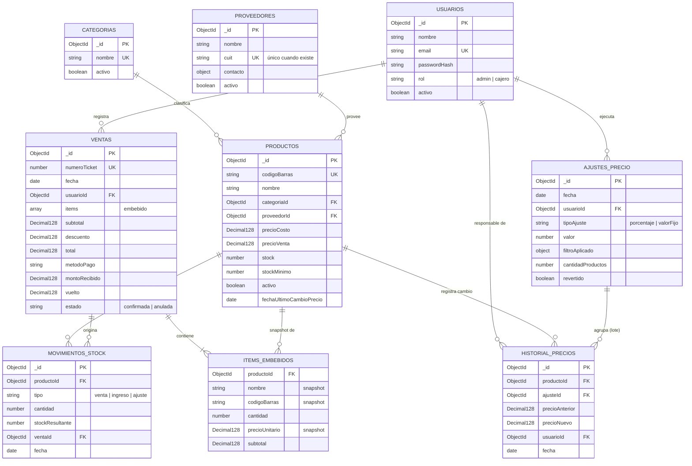
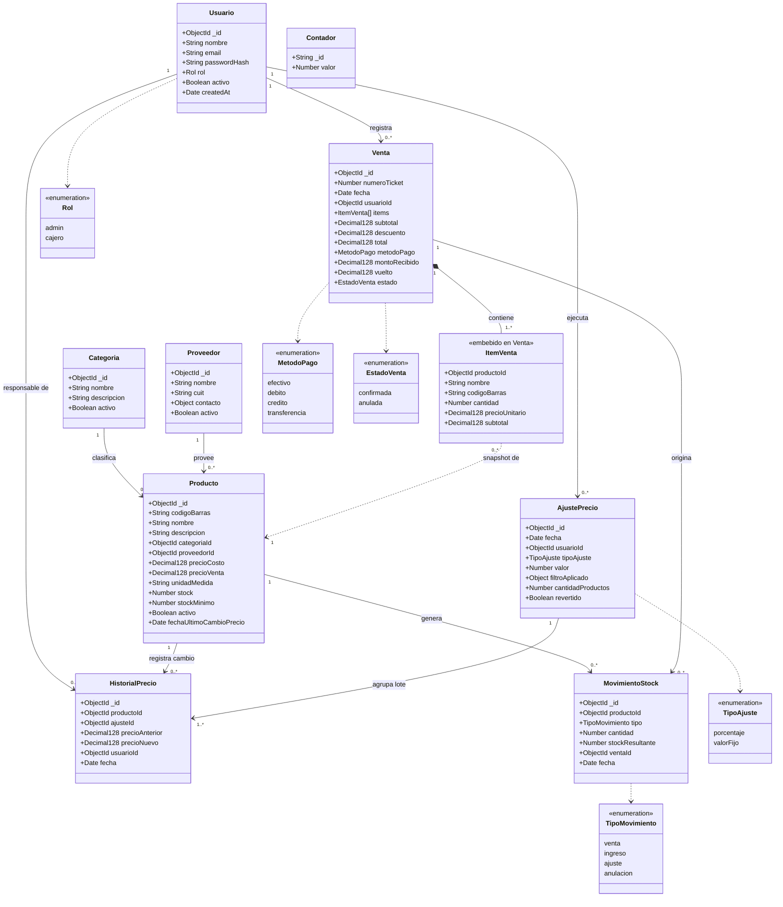

# Esquema de la Base de Datos

**Proyecto:** Sistema Centralizado de Punto de Venta (POS) e Inventario
**Materia:** UTN — Tecnicatura Universitaria en Programación
**Entrega:** 2.ª Entrega — Diseño y Módulos (Condición de Regular)
**Integrantes:** Ignacio Salazar, Martin Gomez, Walter Verdun
**Stack:** MERN (MongoDB, Express, React, Node)
**Motor de base de datos:** MongoDB — modelo documental

---

## 1. Objetivo y alcance del documento

Este documento presenta el diseño completo de la base de datos del sistema, definido a partir de la problemática y los módulos identificados en la primera entrega (Actividad U1-A1). Su finalidad es ser revisado y aprobado por el tutor y por el comité de trabajo final antes de comenzar la implementación.

El esquema aquí definido es la referencia sobre la cual se desarrollan los modelos de Mongoose del repositorio. Cualquier cambio posterior debe registrarse en este mismo archivo, indicando el motivo del cambio.

---

## 2. Elección del modelo de datos: documental (MongoDB)

El proyecto adopta un modelo documental. La decisión no se apoya únicamente en la coherencia con el stack MERN, sino en el análisis de las operaciones reales del sistema:

| Criterio | Modelo relacional (SQL) | Modelo documental (MongoDB) |
|---|---|---|
| Lectura de un producto en caja | Requiere JOIN entre las tablas de productos, categorías y precios. | Un único documento contiene todo lo que la caja necesita: una sola lectura. |
| Registro de una venta | Se divide en dos tablas (`venta` y `detalle_venta`) unidas por clave foránea. | El ticket es un documento autocontenido con sus ítems embebidos: se guarda y se lee en una operación. |
| Aumento masivo de precios | `UPDATE ... WHERE`. Eficiente. | `updateMany` con pipeline de agregación. Igualmente eficiente y ejecutado en el servidor. |
| Atributos variables por rubro | Exige `ALTER TABLE` y migraciones. | Esquema flexible: se agregan campos sin migrar la base. |
| Integridad referencial | Garantizada por el motor mediante claves foráneas. | **No la garantiza el motor**: debe implementarse en la aplicación (desventaja asumida, ver punto 9). |
| Integración con el stack | Requiere mapeo objeto-relacional. | JSON de extremo a extremo: el mismo formato en base, API y frontend. |

**Conclusión:** el modelo documental favorece las dos operaciones más frecuentes del sistema (la venta en caja y la actualización masiva de precios). La única desventaja relevante —la falta de integridad referencial nativa— se compensa con validaciones en la capa de aplicación y con el uso de bajas lógicas, según se detalla en el punto 9.

---

## 3. Criterios de diseño aplicados

- **Embeber lo que se lee siempre junto y no se comparte.** Los ítems de una venta solo tienen sentido dentro de esa venta: se embeben como subdocumentos. Los productos, en cambio, tienen vida propia y se consultan por separado: se referencian.

- **Congelar (snapshot) los datos históricos.** Cada ítem de una venta guarda una copia del nombre, del precio unitario y del precio de costo al momento de la operación. Si mañana el producto aumenta, el ticket de ayer debe seguir mostrando lo que ralmente se cobró, y los reportes de rentabilidad deben calcular el margen con el costo de ese momento y no el actual

- **Baja lógica en lugar de borrado físico.** Los productos y usuarios no se eliminan: se marcan con `activo: false`. Así ninguna venta histórica queda apuntando a un documento inexistente.

- **Trazabilidad de todo cambio de precio.** Cada modificación queda registrada con su valor anterior, su valor nuevo, el usuario que la hizo y el lote al que pertenece. Esto permite auditar y, sobre todo, revertir un aumento aplicado por error.

- **Precios con tipo decimal exacto.** Se utiliza `Decimal128` en lugar de punto flotante para evitar errores de redondeo en importes de dinero.

---

## 4. Diagramas

### 4.1 Diagrama entidad-relación



### 4.2 Diagrama UML de clases

Notación: `Venta *-- ItemVenta` es una **composición** (los ítems no existen fuera de su venta, están embebidos). `ItemVenta ..> Producto` es una **dependencia**, no una asociación fuerte: el ítem guarda el `productoId` pero también una copia del nombre y del precio, por lo que no depende del producto para mostrarse.



---

## 5. Detalle de las colecciones

### `usuarios`
Cuentas de acceso al sistema y sus permisos.

| Campo | Tipo | Req. | Descripción |
|---|---|:--:|---|
| `_id` | ObjectId | auto | Identificador único generado por MongoDB. |
| `nombre` | String | Sí | Nombre y apellido del usuario. |
| `email` | String | Sí | Usuario de acceso. Único, almacenado en minúsculas. |
| `passwordHash` | String | Sí | Contraseña cifrada con bcrypt. Nunca se guarda en texto plano. |
| `rol` | String | Sí | Valores admitidos: `admin` \| `cajero`. Define los permisos en la API y en la interfaz. |
| `activo` | Boolean | Sí | Baja lógica. Un usuario inactivo no puede iniciar sesión, pero sus ventas se conservan. |
| `createdAt` / `updatedAt` | Date | auto | Marcas de tiempo generadas automáticamente por Mongoose. |

### `categorias`
Clasificación de productos, base del filtrado para aumentos masivos.

| Campo | Tipo | Req. | Descripción |
|---|---|:--:|---|
| `_id` | ObjectId | auto | Identificador único. |
| `nombre` | String | Sí | Nombre de la categoría (ej. Bebidas, Limpieza). Único. |
| `descripcion` | String | No | Detalle opcional. |
| `activo` | Boolean | Sí | Baja lógica. |

### `proveedores`
Datos del proveedor. Permite aumentar precios filtrando por proveedor.

| Campo | Tipo | Req. | Descripción |
|---|---|:--:|---|
| `_id` | ObjectId | auto | Identificador único. |
| `nombre` | String | Sí | Razón social o nombre comercial. |
| `cuit` | String | No | CUIT del proveedor. Único cuando existe: no puede haber dos proveedores con el mismo CUIT (ver índices). |
| `contacto` | Object | No | Subdocumento con teléfono y email. |
| `activo` | Boolean | Sí | Baja lógica. |

### `productos`
Colección central del sistema: catálogo, precios y stock.

| Campo | Tipo | Req. | Descripción |
|---|---|:--:|---|
| `_id` | ObjectId | auto | Identificador único. |
| `codigoBarras` | String | No | Único cuando existe. Es la clave de búsqueda en caja. |
| `nombre` | String | Sí | Denominación del producto. |
| `descripcion` | String | No | Detalle opcional. |
| `categoriaId` | ObjectId | Sí | Referencia a `categorias`. |
| `proveedorId` | ObjectId | No | Referencia a `proveedores`. |
| `precioCosto` | Decimal128 | Sí | Costo de compra, base para calcular el margen. |
| `precioVenta` | Decimal128 | Sí | Precio exhibido en góndola y cobrado en caja. |
| `unidadMedida` | String | Sí | `unidad` \| `kg` \| `litro`. |
| `stock` | Number | Sí | Existencia actual. Se descuenta automáticamente en cada venta. |
| `stockMinimo` | Number | Sí | Umbral que dispara la alerta de stock bajo. |
| `activo` | Boolean | Sí | Baja lógica. |
| `fechaUltimoCambioPrecio` | Date | No | Permite detectar productos rezagados sin remarcar. |

### `ventas`
Ticket de venta como documento autocontenido.

| Campo | Tipo | Req. | Descripción |
|---|---|:--:|---|
| `_id` | ObjectId | auto | Identificador único. |
| `numeroTicket` | Number | Sí | Número correlativo, generado con un contador atómico. |
| `fecha` | Date | Sí | Fecha y hora de la operación. |
| `usuarioId` | ObjectId | Sí | Referencia al cajero que realizó la venta. |
| `items` | Array&lt;Item&gt; | Sí | Subdocumentos embebidos (ver detalle a continuación). |
| `subtotal` | Decimal128 | Sí | Suma de los subtotales de los ítems. |
| `descuento` | Decimal128 | No | Descuento aplicado sobre el total. |
| `total` | Decimal128 | Sí | Importe final cobrado. |
| `metodoPago` | String | Sí | `efectivo` \| `debito` \| `credito` \| `transferencia`. |
| `montoRecibido` | Decimal128 | No | Efectivo entregado por el cliente. |
| `vuelto` | Decimal128 | No | Diferencia calculada automáticamente. |
| `estado` | String | Sí | `confirmada` \| `anulada`. La anulación no borra el documento. |

### `items` (subdocumento embebido en `ventas`)

| Campo | Tipo | Req. | Descripción |
|---|---|:--:|---|
| `productoId` | ObjectId | Sí | Referencia al producto vendido. |
| `nombre` | String | Sí | Copia del nombre al momento de la venta (snapshot). |
| `codigoBarras` | String | No | Copia del código al momento de la venta (snapshot). |
| `cantidad` | Number | Sí | Unidades o peso vendido. |
| `precioUnitario` | Decimal128 | Sí | Precio cobrado en ese momento (snapshot). No cambia si el producto aumenta después. |
| `subtotal` | Decimal128 | Sí | `cantidad × precioUnitario`. |

### `ajustes_precio`
Registro del lote: cada aumento masivo ejecutado.

| Campo | Tipo | Req. | Descripción |
|---|---|:--:|---|
| `_id` | ObjectId | auto | Identificador único del lote. |
| `fecha` | Date | Sí | Momento de aplicación. |
| `usuarioId` | ObjectId | Sí | Administrador que ejecutó el ajuste. |
| `tipoAjuste` | String | Sí | `porcentaje` \| `valorFijo`. |
| `valor` | Number | Sí | Porcentaje aplicado (ej. 10) o importe fijo. |
| `filtroAplicado` | Object | No | Criterio usado (categoría, proveedor, texto de búsqueda). |
| `cantidadProductos` | Number | Sí | Cantidad de productos afectados. |
| `revertido` | Boolean | Sí | Indica si el lote fue deshecho. |

### `historial_precios`
Detalle por producto de cada cambio de precio.

| Campo | Tipo | Req. | Descripción |
|---|---|:--:|---|
| `_id` | ObjectId | auto | Identificador único. |
| `productoId` | ObjectId | Sí | Producto afectado. |
| `ajusteId` | ObjectId | No | Lote al que pertenece. Vacío si fue un cambio individual. |
| `precioAnterior` | Decimal128 | Sí | Valor previo. Permite revertir el cambio. |
| `precioNuevo` | Decimal128 | Sí | Valor resultante. |
| `usuarioId` | ObjectId | Sí | Responsable del cambio. |
| `fecha` | Date | Sí | Momento del cambio. |

### `movimientos_stock`
Trazabilidad de las variaciones de existencias.

| Campo | Tipo | Req. | Descripción |
|---|---|:--:|---|
| `_id` | ObjectId | auto | Identificador único. |
| `productoId` | ObjectId | Sí | Producto afectado. |
| `tipo` | String | Sí | `venta` \| `ingreso` \| `ajuste` \| `anulacion`. |
| `cantidad` | Number | Sí | Positiva o negativa según el tipo de movimiento. |
| `stockResultante` | Number | Sí | Existencia luego del movimiento. |
| `ventaId` | ObjectId | No | Venta que originó el movimiento, si corresponde. |
| `fecha` | Date | Sí | Momento del movimiento. |

### `contadores`
Colección auxiliar para numeración correlativa.

| Campo | Tipo | Req. | Descripción |
|---|---|:--:|---|
| `_id` | String | Sí | Nombre del contador (ej. `"numeroTicket"`). |
| `valor` | Number | Sí | Último valor asignado. Se incrementa de forma atómica con `$inc`. |

---

## 6. Índices definidos

Los índices se definen a partir de las consultas reales del sistema, no de forma genérica:

| Colección | Índice | Tipo | Motivo |
|---|---|---|---|
| `usuarios` | `{ email: 1 }` | Único | Evita cuentas duplicadas y acelera el login. |
| `proveedores` | `{ cuit: 1 }` | Único, parcial | Evita registrar dos veces al mismo proveedor. Parcial (`partialFilterExpression: { cuit: { $type: "string" } }`) porque el CUIT es opcional: la unicidad solo se exige a los proveedores que lo tienen cargado. |
| `productos` | `{ codigoBarras: 1 }` | Único, sparse | Búsqueda instantánea en caja. Sparse porque hay productos sin código. |
| `productos` | `{ nombre: "text" }` | Texto | Búsqueda por nombre parcial desde el POS. |
| `productos` | `{ categoriaId: 1, activo: 1 }` | Compuesto | Filtrado de productos para el aumento masivo. |
| `productos` | `{ activo: 1, stock: 1 }` | Compuesto | Consulta de alertas de stock bajo. |
| `ventas` | `{ numeroTicket: 1 }` | Único | Garantiza que no se repita la numeración. |
| `ventas` | `{ fecha: -1 }` | Simple | Reportes por período, ordenados de más reciente a más antiguo. |
| `historial_precios` | `{ productoId: 1, fecha: -1 }` | Compuesto | Historial de precios de un producto. |
| `historial_precios` | `{ ajusteId: 1 }` | Simple | Permite revertir un lote completo en una sola consulta. |
| `movimientos_stock` | `{ productoId: 1, fecha: -1 }` | Compuesto | Trazabilidad del stock de un producto. |

---

## 7. Relaciones entre colecciones

| Origen | Destino | Cardinalidad | Implementación |
|---|---|:--:|---|
| `productos` | `categorias` | N : 1 | Campo `categoriaId`, resuelto con `populate`. |
| `productos` | `proveedores` | N : 1 | Campo `proveedorId`, resuelto con `populate`. |
| `ventas` | `usuarios` | N : 1 | Campo `usuarioId`. |
| `ventas` ↔ `productos` | (vía `items`) | N : M | Array embebido con `productoId` más copia de nombre y precio. |
| `historial_precios` | `productos` | N : 1 | Campo `productoId`. |
| `historial_precios` | `ajustes_precio` | N : 1 | Campo `ajusteId`: agrupa todos los cambios de un mismo lote. |
| `historial_precios` | `usuarios` | N : 1 | Campo `usuarioId`: responsable del cambio. |
| `ajustes_precio` | `usuarios` | N : 1 | Campo `usuarioId`. |
| `movimientos_stock` | `productos` / `ventas` | N : 1 | Campos `productoId` y `ventaId`. |

---

## 8. Operaciones críticas soportadas por el esquema

Para validar que el diseño responde a los requerimientos, se detallan las operaciones centrales del sistema.

### 8.1 Búsqueda de un producto en caja

Con el índice único sobre el código de barras, la lectura es directa y no requiere recorrer la colección:

```js
db.productos.findOne({ codigoBarras: "7790895000123", activo: true })
```

### 8.2 Confirmación de una venta (descuento de stock atómico)

La condición sobre el stock se incluye dentro de la propia actualización. Si otra caja ya descontó esas unidades, la operación no se aplica y la venta se rechaza, evitando vender existencias inexistentes:

```js
const session = await mongoose.startSession();
await session.withTransaction(async () => {
  for (const item of items) {
    const r = await Producto.updateOne(
      { _id: item.productoId, stock: { $gte: item.cantidad } },
      { $inc: { stock: -item.cantidad } },
      { session });
    if (r.modifiedCount === 0) throw new Error('Stock insuficiente');
  }
  await Venta.create([venta], { session });
});
```

### 8.3 Aumento masivo de precios (innovación central del proyecto)

Todo el aumento se resuelve en una sola operación ejecutada en el servidor de base de datos: no se traen los productos a la aplicación ni se recorren uno por uno. Actualizar 500 productos cuesta lo mismo que actualizar uno.

```js
await Producto.updateMany(
  { categoriaId: categoriaId, activo: true },
  [ { $set: {
        precioVenta: { $round: [ { $multiply: ['$precioVenta', 1.10] }, 2 ] },
        fechaUltimoCambioPrecio: '$$NOW'
  } } ]
);
```

### 8.4 Reversión de un aumento aplicado por error

Como cada cambio queda registrado en `historial_precios` junto con su `ajusteId`, es posible recuperar todos los precios anteriores de un lote y restaurarlos. Esta operación no sería posible si el sistema solo guardara el precio actual del producto.

### 8.5 Alerta de stock bajo

La comparación entre dos campos del mismo documento se resuelve con una expresión de agregación:

```js
db.productos.find({
  activo: true,
  $expr: { $lte: ['$stock', '$stockMinimo'] }
})
```

---

## 9. Integridad y validaciones

Dado que MongoDB no impone integridad referencial, el sistema la garantiza desde la aplicación mediante las siguientes reglas:

- **Validación en los modelos de Mongoose:** campos obligatorios, tipos, valores admitidos en los campos de tipo enumerado y verificación de existencia de los documentos referenciados antes de insertar.
- **Índices únicos:** la unicidad del email, del código de barras y del CUIT del proveedor la garantiza el motor mediante índices, no el código de la aplicación.
- **Bajas lógicas:** ningún producto, usuario o categoría se elimina físicamente, de modo que las ventas históricas nunca quedan huérfanas.
- **Snapshots en las ventas:** el ticket conserva el nombre y el precio del momento, por lo que un cambio posterior en el producto no altera la información histórica.
- **Transacciones:** el descuento de stock y el registro de la venta se ejecutan dentro de una misma transacción, de modo que ambos se confirman o ninguno.
- **Validación de esquema en la base:** se prevé aplicar reglas de `$jsonSchema` sobre las colecciones críticas como segunda barrera ante datos inválidos.

---

## 10. Alcance de implementación por etapa

No todas las colecciones se implementan de una vez. Sin embargo, todas quedan definidas desde ahora para evitar migraciones posteriores del modelo de datos:

| Colección | Etapa | Observación |
|---|:--:|---|
| `usuarios` | Etapa 1 | Necesaria para el login y los permisos por rol. |
| `categorias` | Etapa 1 | Requerida para filtrar productos en el aumento masivo. |
| `productos` | Etapa 1 | Colección central del sistema. |
| `ventas` (con `items`) | Etapa 1 | Núcleo del punto de venta. |
| `contadores` | Etapa 1 | Numeración correlativa de tickets. |
| `ajustes_precio` | Etapa 1 | Soporta la innovación central del proyecto. |
| `historial_precios` | Etapa 1 | Se completa junto con cada ajuste de precios. |
| `proveedores` | Etapa 2 | El campo `proveedorId` ya se define en `productos` para no migrar después. |
| `movimientos_stock` | Etapa 2 | En la Etapa 1 el stock se descuenta directamente sobre el producto. |

---

## Registro de cambios

| Fecha | Cambio | Responsable |
|---|---|---|
| 2026-09-09 | Versión inicial del esquema, presentada para aprobación del tutor. | Grupo |
| 2026-09-26 | Se define índice único parcial sobre `cuit` en `proveedores` (mejora 3 sugerida por el tutor). | Ignacio Salazar |
